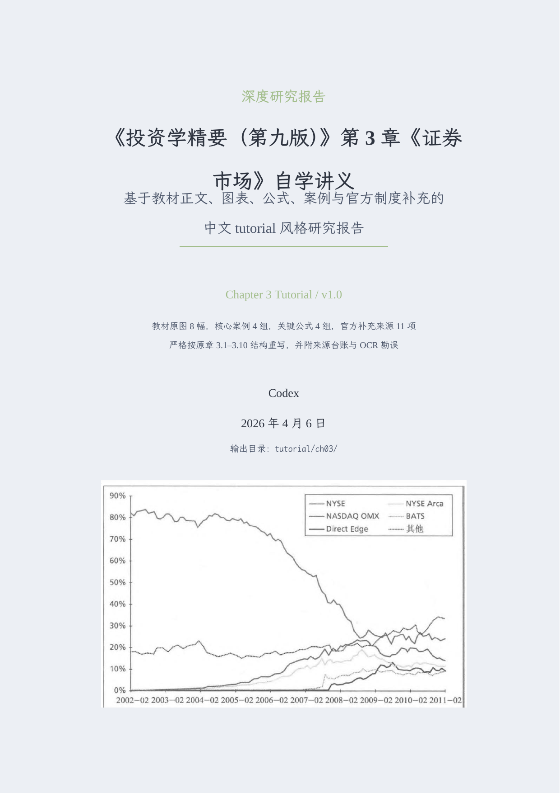
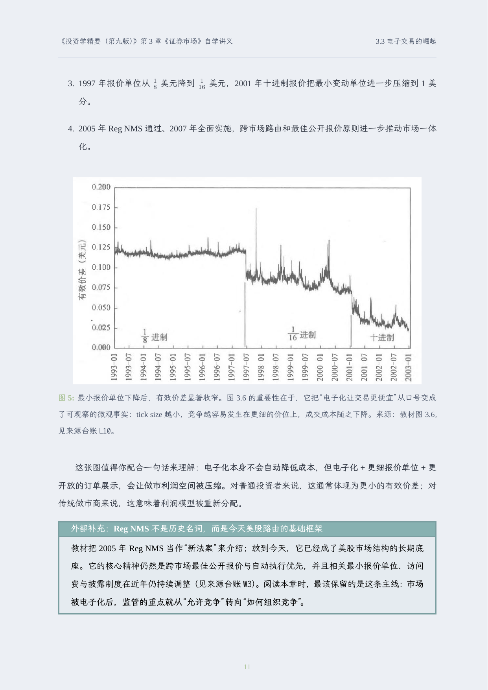
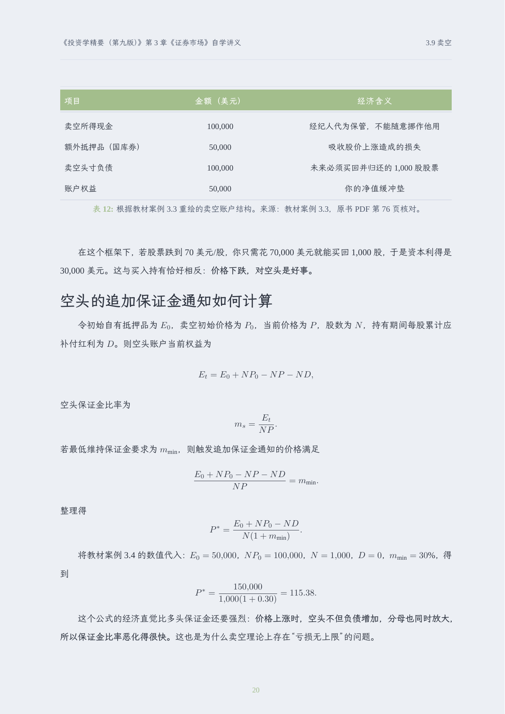
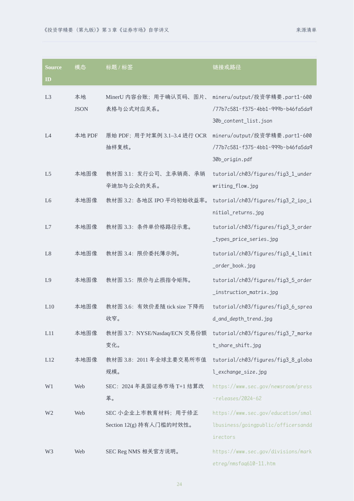

# Deep Research Skill

`deepresearch-skill` 用来把网页、PDF、图片、视频、代码和结构化数据等多模态材料，整理成一份可交付的 LaTeX + PDF 深度研究报告。

[SKILL.md](./SKILL.md) 面向 agent，定义 workflow 和约束；这份 README 面向人，展示这个 skill 最终能交付什么。

## 典型产物

- 可编译的 `report.tex`
- 渲染完成的 `report.pdf`
- 报告里实际使用的图片或图表资产
- 可追溯的来源台账、方法说明和必要的勘误记录

## 仓库内示例

仓库现在附带一个真实例子：基于《投资学精要（第九版）》第 3 章《证券市场》生成的中文 tutorial 风格研究报告。

- 例子说明: [examples/ch03-securities-market/README.md](./examples/ch03-securities-market/README.md)
- 原始 prompt: [examples/ch03-securities-market/prompt.md](./examples/ch03-securities-market/prompt.md)
- 最终 PDF: [examples/ch03-securities-market/report.pdf](./examples/ch03-securities-market/report.pdf)

这个例子展示了 deepresearch skill 的几个核心能力：

- 按教材章节结构重写，而不是把 OCR 或 Markdown 直接塞进 LaTeX
- 在正文中混合图表、公式、表格和解释性 callout
- 明确区分教材内容与联网补充
- 把来源清单和 OCR 勘误保留在最终交付物里，保证可追溯

## PDF 截图预览

  
  

  
  

对应内容分别是：

- 封面和交付包装信息
- 正文里把教材图表嵌回论证
- 公式推导和表格重绘
- 最终来源台账，保留审计路径

## 什么时候看这个 README

如果你想快速判断这个 skill 适不适合你的任务，先看这里。

如果你已经确定要让 agent 执行 deepresearch workflow，直接看 [SKILL.md](./SKILL.md)。
